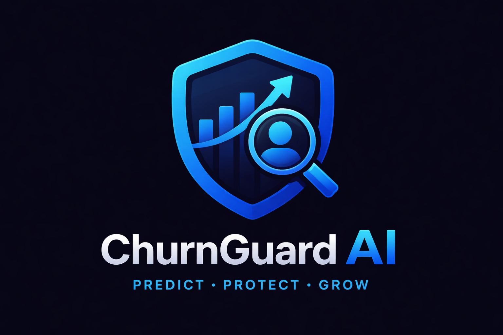
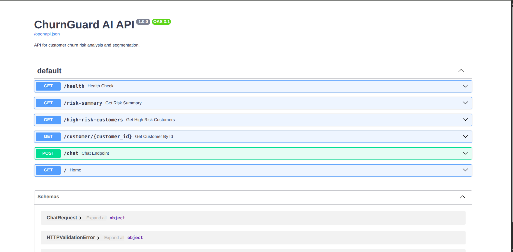
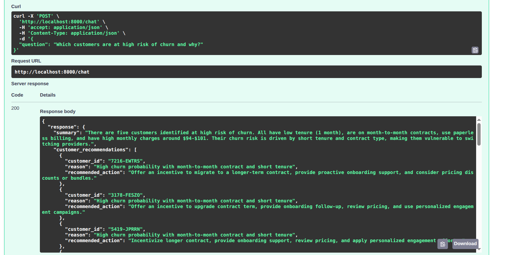
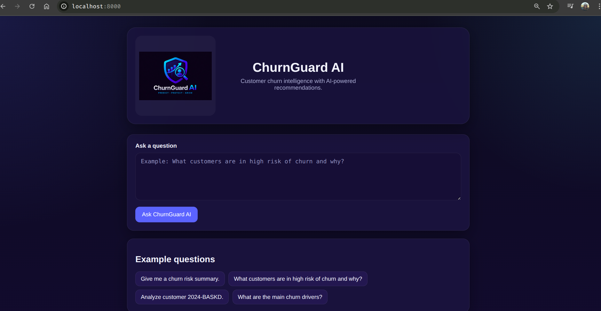
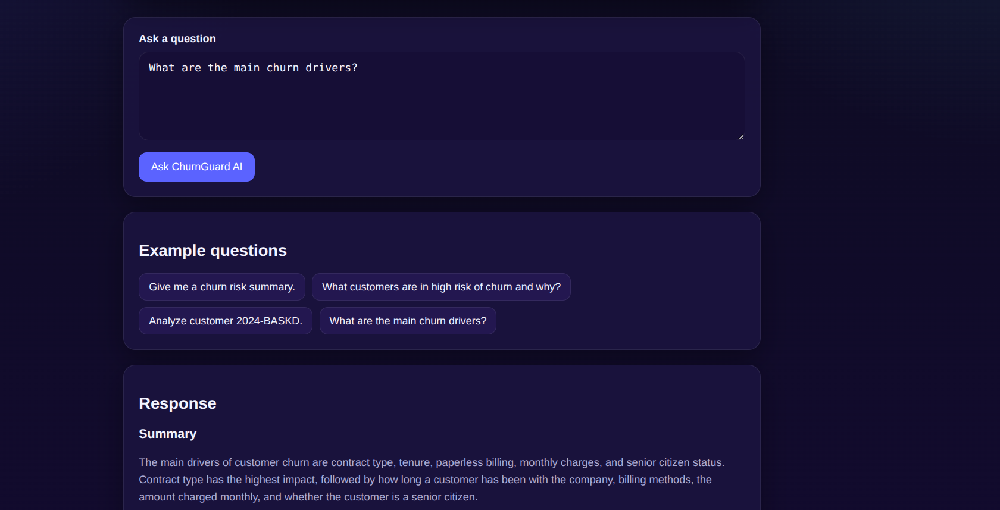
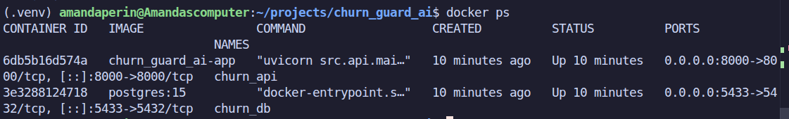

# 🚀 ChurnGuard AI  
### End-to-End Churn Prediction System with Machine Learning, Statistical Validation, API and LLM Chatbot

---

## 📌 Overview

ChurnGuard AI is a complete end-to-end machine learning system designed to predict customer churn and provide explainable business insights.

This project goes beyond prediction by combining:

- Machine Learning (XGBoost)
- Statistical validation (hypothesis testing)
- Feature engineering pipeline
- REST API with FastAPI
- LLM-powered chatbot for business explanations
- Dockerized deployment

---

## 🎯 Business Problem

Customer churn is one of the biggest challenges for subscription-based companies.

Instead of reacting after churn happens, this system allows:

- Early identification of high-risk customers
- Understanding the drivers of churn
- Data-driven retention strategies

---

## 🏗️ Architecture

Bronze → Silver → Features → Gold → API → Chatbot

| Layer | Description |
|------|------------|
| Bronze | Raw data ingestion (CSV) |
| Silver | Cleaned and standardized data |
| Features | Feature engineering for ML |
| Gold | Predictions + analytics |
| API | Model serving |
| Chatbot | Business explanation |

---

## ⚙️ Machine Learning Model

### Model Choice: XGBoost

Why XGBoost?

- High performance on tabular data
- Handles nonlinear relationships
- Robust to feature scaling
- Built-in regularization

---

### 🔧 Hyperparameter Tuning

| Parameter | Value |
|----------|------|
| subsample | 0.9 |
| n_estimators | 100 |
| min_child_weight | 1 |
| max_depth | 3 |
| learning_rate | 0.05 |
| gamma | 0.3 |
| colsample_bytree | 0.8 |

---

## 📊 Model Performance

| Metric | Value |
|--------|-------|
| ROC AUC (CV) | 0.8420 |
| ROC AUC (Test) | 0.8367 |

---

## 🎯 Threshold Optimization

| Threshold | Precision | Recall | F1-score |
|----------|----------|--------|----------|
| 0.5 | 0.6591 | 0.4652 | 0.5455 |
| 0.4 | 0.5935 | 0.6364 | 0.6142 |
| 0.3 | 0.5191 | 0.7620 | 0.6176 |

Business insight:

- Lower threshold → detect more churners (higher recall)
- Higher threshold → fewer false positives

---

## 📊 Statistical Analysis

### 🔹 Chi-Square Test (Categorical Variables)

Tests association between features and churn.

| Variable | p-value | Effect Size (Cramér’s V) | Significant |
|----------|--------|--------------------------|-------------|
| contract | 0.0 | 0.4101 | Yes |
| paperless_billing | 0.0 | 0.1915 | Yes |

---

### 🔹 Mann-Whitney U Test (Numerical Variables)

Tests difference between churned vs non-churned distributions.

| Variable | p-value | Mean (Churn=1) | Mean (Churn=0) | Significant |
|----------|--------|----------------|----------------|-------------|
| total_charges | 0.0 | 1531.79 | 2555.34 | Yes |

---

### 📉 Churn Rate by Contract Type

| Contract | Customers | Churn | Rate |
|----------|----------|------|------|
| Month-to-month | 3875 | 1655 | 42.7% |
| One year | 1473 | 166 | 11.3% |
| Two year | 1695 | 48 | 2.8% |

Insight: contract length is the strongest churn driver.

---

## 🤖 API

### Endpoint

POST /chat

### Example Request

{
  "question": "Which customers are at high risk of churn and why?"
}

### Response

- Summary
- Customer-level explanations
- Recommended actions

---

## 🐳 Docker

Run everything with:

docker compose up --build

### Services

| Service | Description |
|--------|------------|
| churn_api | FastAPI backend |
| churn_db | PostgreSQL |

---

## 📸 Screenshots 

### Project Logo

### Swagger UI

### Chatbot Output

### Docker Running

## 💼 Skills Used

- Machine Learning (XGBoost)
- Feature Engineering
- Statistical Testing
- Backend Development (FastAPI)
- LLM Integration
- Docker Deployment
- Data Pipeline Design

---

